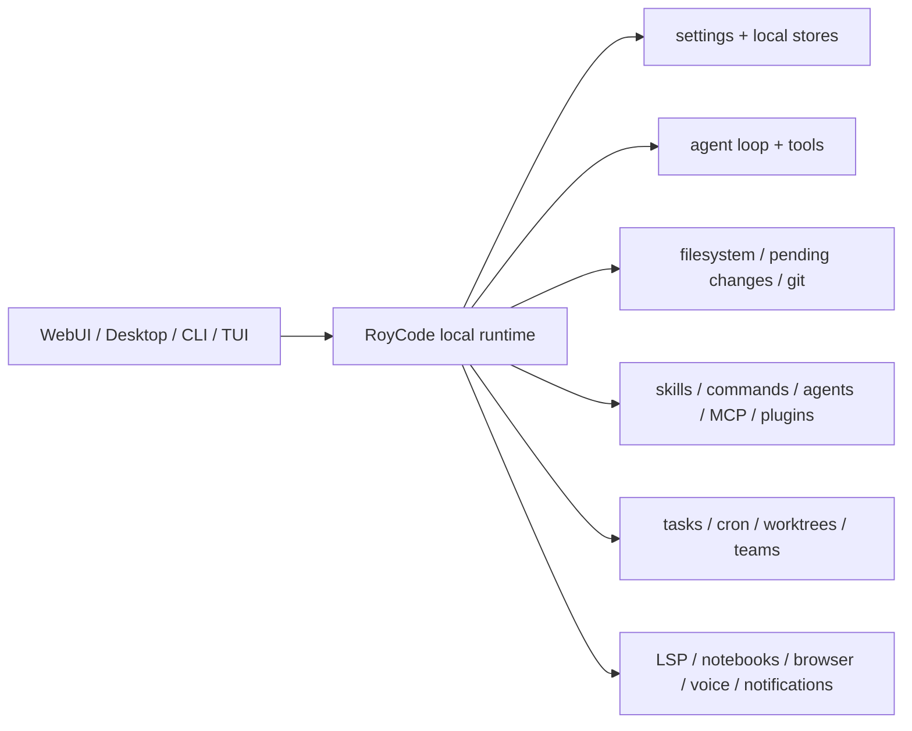
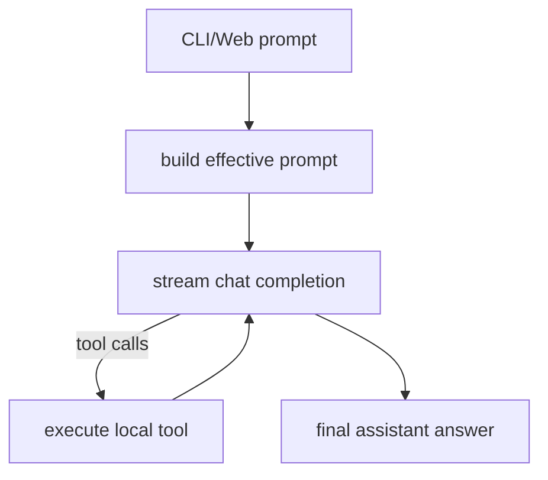

# RoyCode Development Manual

## 1. Purpose

This document is the internal architecture guide for RoyCode Studio. It is written so future development can continue without needing to re-discover how the current local runtime fits together.

RoyCode is intentionally split into:

- a shared local backend/runtime
- multiple user surfaces on top of that runtime
- a Claude Code compatibility layer for `.claude` workflows, skills, commands, agents, rules, and memory

The CLI/TUI is the most feature-complete surface and should be treated as the primary product core.

## 2. Repository Layout

Top-level relevant paths:

- `src/` - React frontend for WebUI
- `server/` - shared backend and terminal runtime
- `desktop/` - Electron host shell
- `data/` - local persisted runtime state
- `dist/` - built frontend
- `dist-server/` - built backend/CLI

The most important runtime folder is `server/`.

## 3. Product Surfaces

### WebUI

- entry: `src/App.tsx`
- backend: `server/index.ts`
- purpose: browser workspace, files, sessions, terminal dock, model control

### Desktop

- entry: `desktop/main.cjs`
- preload bridge: `desktop/preload.cjs`
- purpose: native Electron shell around the same local backend

### CLI

- entry: `server/cli.ts`
- purpose: direct slash-command and prompt-driven terminal workflow

### TUI

- entry: `server/tui.tsx`
- purpose: Ink wrapper around the CLI process with workspace/status panes and shortcuts

## 4. High-Level Runtime Architecture



## 5. Core Server Modules

### `server/index.ts`

Responsibilities:

- Express API bootstrap
- REST endpoints for settings, files, git, pending changes, chat
- cron scheduler startup
- static client serving for production

Use this file when:

- adding a new HTTP endpoint
- exposing backend functionality to WebUI/Desktop
- updating settings payload schema

### `server/store.ts`

Responsibilities:

- persistent `data/settings.json`
- default settings
- runtime normalization
- public/private settings conversion

This is the root config layer for:

- provider selection
- workspace root
- access mode
- UI/runtime flags

### `server/types.ts`

Responsibilities:

- shared runtime types used across server modules
- app settings
- chat and tool stream event types
- filesystem/git payloads

When you add a new setting or runtime payload, start here.

## 6. CLI/TUI Layer

### `server/cli.ts`

This is the single most important file in the local terminal runtime.

Main responsibilities:

- CLI arg parsing
- interactive readline loop
- slash-command dispatch
- session status rendering
- prompt execution
- session persistence
- Claude-style local workflow commands

Major internal areas:

- state creation and loading
- output helpers
- slash-command parser and dispatcher
- prompt execution (`runPromptInternal`)
- session workflow (`/branch`, `/summary`, `/compact`, `/rewind`, `/resume`)
- advanced runtime commands (`/cron`, `/team`, `/mcp`, `/bridge`, `/worktree`, `/lsp`, `/notebook`)

### `server/tui.tsx`

Responsibilities:

- spawn CLI as a child process
- parse status output
- show workspace/status panes
- relay input and shortcuts to CLI

Important design decision:

- TUI is a shell over the CLI, not a second independent runtime
- feature work should usually land in `server/cli.ts` first
- `server/tui.tsx` should stay focused on presentation and transport

## 7. Prompt Execution and Agent Loop

### `server/agent.ts`

Responsibilities:

- local OpenAI-compatible chat client wiring
- streamed tool loop
- structured tool definitions
- tool dispatch
- segmented system prompt execution

The local agent flow is:



Important functions:

- `buildAvailableToolDefinitions(...)`
- `executeTool(...)`
- `collectStreamingAssistantTurn(...)`
- `runAgentChatInternal(...)`

Tool categories currently handled here:

- filesystem
- search
- shell
- web search/fetch
- rules, config, output styles
- todos
- structured question flow
- worktree, cron, notebook, LSP
- team/task helpers
- remote trigger helpers

### `server/systemPrompt.ts`

Responsibilities:

- layered system prompt composition
- runtime policy sections
- workspace instructions
- skill/task/memory sections

This is the main place to modify RoyCode’s core behavior without rewriting tool code.

## 8. Session and State Persistence

### `server/cliSessions.ts`

Stores persisted CLI sessions in `data/cli-sessions.json`.

Session record includes:

- transcript
- workspace root
- provider/model
- cwd
- skill state
- compact summaries
- execution mode
- worktree bindings

### `server/tasks.ts`

Stores background task state in `data/tasks.json` and logs in `data/task-logs/`.

Responsibilities:

- task creation
- task metadata updates
- runner pid tracking
- task stop/restart support

### `server/task-runner.ts`

Detached worker process for background tasks.

Responsibilities:

- load one task
- execute streamed agent run
- append logs
- update status/result
- emit hooks
- record usage
- trigger local notifications on completion/failure

## 9. Filesystem, Pending Changes, and Git

### `server/filesystem.ts`

Responsibilities:

- workspace tree
- file reads/writes
- shell command execution
- path safety and access mode enforcement

### `server/pendingChanges.ts`

Responsibilities:

- stage edits before write
- safe-write approval queue
- batch apply/reject
- chunk-oriented workflows

### `server/git.ts`

Responsibilities:

- git status
- diff
- stage/unstage
- commit

## 10. Claude Compatibility Layer

### `server/claudeCompat.ts`

Responsibilities:

- `.claude/rules`
- `.claude/output-styles`
- `.claude/agent-memory`
- nested `.claude` discovery

### `server/localCommands.ts`

Responsibilities:

- project/user `.claude/commands`
- markdown frontmatter parsing
- command prompt assembly

### `server/localAgents.ts`

Responsibilities:

- project/user `.claude/agents`
- local subagent definitions
- model/tools/memory/skill metadata

### `server/skills.ts`

Responsibilities:

- local skill discovery
- built-in skill seeding
- skill prompt composition
- skill import

### `server/pluginRuntime.ts`

Responsibilities:

- local plugin import
- plugin command discovery
- plugin skills
- plugin-provided output styles

### `server/mcp.ts`

Responsibilities:

- local MCP server registry
- project `.mcp.json` discovery
- stdio and Streamable HTTP support
- tools, prompts, resources

## 11. Tasks, Teams, Cron, Worktrees

### `server/cron.ts`

Responsibilities:

- local prompt scheduling
- workspace registration
- due-task execution
- lightweight scheduler lifecycle

### `server/teams.ts`

Responsibilities:

- local team definitions
- team members
- team inbox messages
- team memory
- memory sync from messages

### `server/worktrees.ts`

Responsibilities:

- list/add/remove git worktrees
- inspection helpers
- lookup/switch support for `teleport`

## 12. Code Intelligence and Notebook Support

### `server/lsp.ts`

Responsibilities:

- TypeScript/JavaScript code intelligence
- diagnostics
- definitions
- implementations
- references
- rename preview/apply
- hover
- document/workspace symbols

### `server/notebooks.ts`

Responsibilities:

- `.ipynb` parsing
- cell listing, reading, updating, insertion, deletion

## 13. Bridge, Marketplace, Remote Triggers

### `server/bridges.ts`

Responsibilities:

- self-hosted RoyCode-to-RoyCode bridge registry
- ping/context/run flows

### `server/marketplace.ts`

Responsibilities:

- local/self-hosted marketplace entries
- install from path or git source

### `server/remoteTriggers.ts`

Responsibilities:

- reusable HTTP trigger registry
- trigger enable/disable
- trigger firing

## 14. Local Runtime Extras

### `server/chrome.ts`

Local helper for:

- opening URLs
- browser search

### `server/web.ts`

Local public web retrieval layer:

- web search
- fetch readable webpage text

### `server/voice.ts`

Current local Windows voice helpers:

- text-to-speech
- one-shot speech-to-text capture

### `server/notifier.ts`

Current local Windows notification helper:

- desktop balloon notifications

### `server/sleepGuard.ts`

Current local Windows keep-awake helper:

- starts/stops a detached process that periodically asserts wake state

### `server/settingsSync.ts`

Local bundle-based sync layer:

- export runtime state to portable bundle
- import bundle back into local `data/`
- optionally redact secrets

### `server/usage.ts`

Local usage accounting:

- run event store
- estimated token tracking
- rough model pricing estimation
- usage and cost summaries

### `server/suggestions.ts`

Local heuristic next-prompt suggestion layer used by:

- `/suggest`
- TUI shortcut flow

## 15. Data Directory Map

Most runtime state is stored in `data/`.

Important files:

- `settings.json` - app configuration and providers
- `cli-sessions.json` - saved terminal sessions
- `tasks.json` - background task state
- `task-logs/` - detached task logs
- `hooks.json` - hook registry
- `todos.json` - CLI todo lists
- `pending-changes.json` - safe-write queue
- `mcp-servers.json` - saved MCP servers
- `plugins.json` - installed plugins
- `bridges.json` - saved bridge endpoints
- `marketplace.json` - local marketplace entries
- `teams.json` - teams, team inbox, team memory
- `workspace-memory/` - persistent workspace memory
- `usage.json` - local usage events
- `sleep-guard.json` - current sleep guard pid state

## 16. How Commands Are Added

To add a new slash command:

1. Add the supporting runtime/service code under `server/` if needed.
2. Add a handler function in `server/cli.ts`.
3. Add routing in `handleSlashCommand(...)`.
4. Add help text in `printHelp()`.
5. If the command mutates state, update `isPlanModeWriteCommand(...)`.
6. If the TUI should expose it, add a shortcut or status field in `server/tui.tsx`.

## 17. How Tools Are Added

To add a new agent tool:

1. Add the tool definition in `server/agent.ts` under `TOOL_DEFINITIONS`.
2. Add the execution branch in `executeTool(...)`.
3. If the tool needs CLI surface support, add or extend a slash command in `server/cli.ts`.
4. If it needs persistence, add a dedicated `server/*.ts` store/service module.
5. Add docs to:
   - `README.md`
   - `USER_MANUAL.md`
   - `DEVELOPMENT_MANUAL.md`

## 18. How Providers Are Added

Main files:

- `server/presets.ts`
- `server/store.ts`
- `server/index.ts`
- `src/App.tsx`

Typical workflow:

1. Add a preset to `server/presets.ts` if it should appear as a named preset.
2. Make sure `ProviderConfig` supports the fields you need.
3. If WebUI/Desktop should expose it cleanly, update the frontend forms and labels.
4. Test both CLI and WebUI model selection.

## 19. How Settings Are Extended

When adding a new persistent setting:

1. Add it to `AppSettings` in `server/types.ts`
2. Add defaults/normalization in `server/store.ts`
3. Add compatibility entries in `server/configCompat.ts`
4. Add HTTP schema support in `server/index.ts`
5. Surface it in CLI/TUI or WebUI if user-visible

## 20. How the Web API Is Extended

Add new routes to `server/index.ts`.

Guidelines:

- keep API payload validation in Zod schemas near the route declarations
- keep heavy logic in dedicated service modules under `server/`
- avoid putting business logic directly in route handlers

## 21. How the TUI Should Evolve

Current design intentionally keeps TUI thin.

Preferred approach:

- add runtime logic to `server/cli.ts`
- keep `server/tui.tsx` focused on:
  - child process lifecycle
  - status parsing
  - layout
  - shortcut routing

This avoids duplicating command behavior across two terminal runtimes.

## 22. Build and Packaging

### Development

```bash
npm run dev
npm run cli
npm run tui
```

### Production build

```bash
npm run build
npm run build:server
```

### Desktop

```bash
npm run desktop
npm run desktop:dist
```

## 23. Validation Workflow

Recommended validation flow after feature work:

1. `npm run build:server`
2. `npx tsc --noEmit`
3. `npm run build`
4. CLI smoke tests with `node bin/roycode.js --plain`
5. only then stage, commit, and push

## 24. Practical Boundaries

These areas are intentionally local approximations, not official parity:

- official Anthropic auth/OAuth flows
- official hosted registry/marketplace
- official remote bridge cloud layer
- internal feature flags
- enterprise-managed settings services

Treat RoyCode as:

- a strong local Claude-style companion
- not a 1:1 clone of Anthropic’s private production environment

## 25. Recommended Next Development Areas

If future work continues, the highest-value next steps are:

1. deeper Ink REPL parity instead of the current shell-wrapper TUI
2. richer prompt suggestion/speculation
3. stronger LSP coverage beyond TS/JS
4. richer task/team orchestration semantics
5. desktop polish and WebUI parity for the newest CLI-only features
